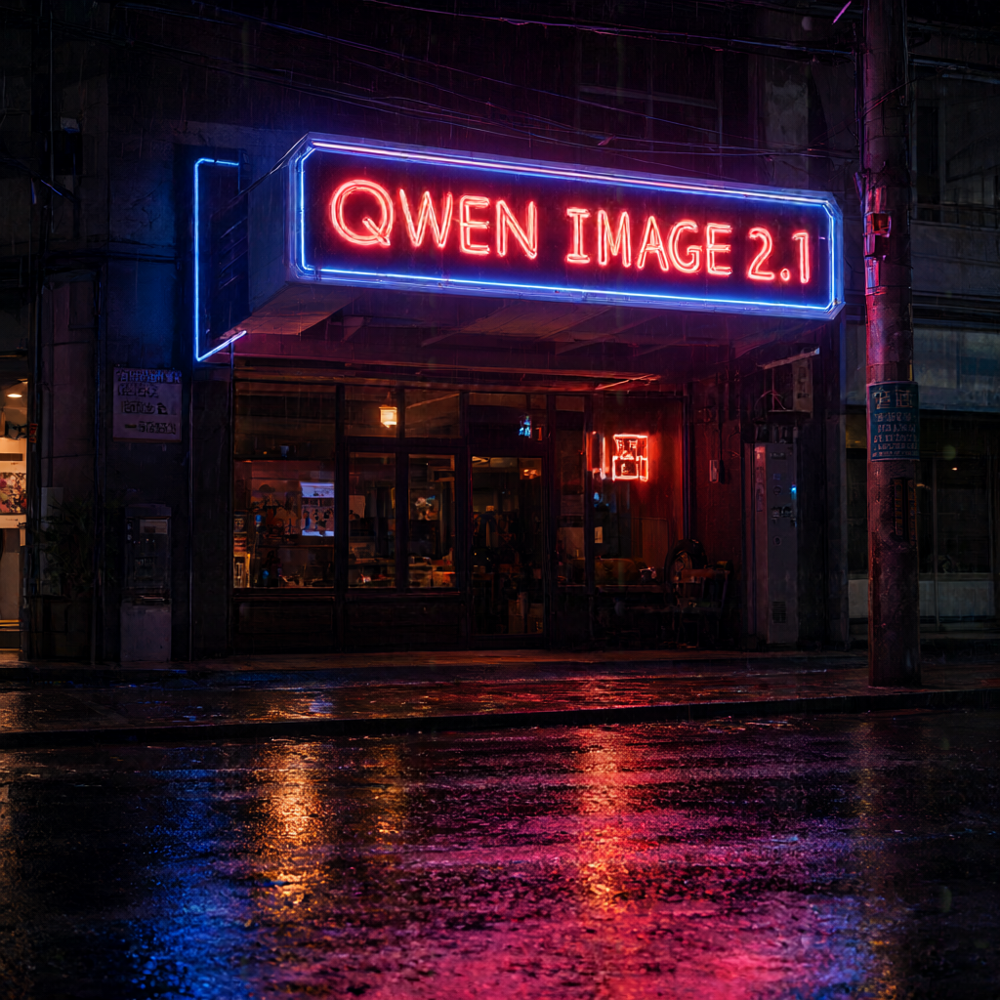
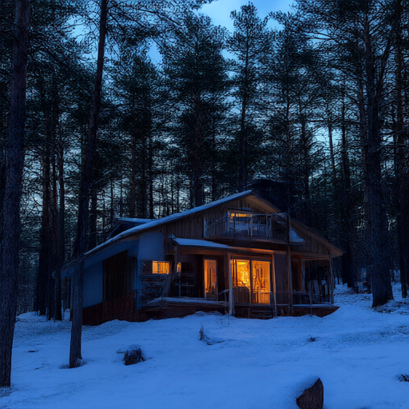

# Qwen-Image-2.1 in FP8 on an RX 9070 XT (RDNA4 / gfx1201)

Running the 7.1 B Qwen-Image-2.1 diffusion transformer on a 16 GB consumer Radeon under
WSL2 + ROCm, using FP8 as a **weight storage** format. Generates 1024×1024 images in
**~138 s (40 steps, 3.44 s/step)** — and text-to-image works today.

Everything here was measured on the target machine. The non-obvious findings are written
down in [`NOTES.md`](NOTES.md) (33 sections) rather than left as folklore, including four
occasions where an earlier conclusion in this project turned out to be **wrong** and had to
be retracted.

---

## What this is (and is not)

This is a **deployment + debugging record**, not a library. It exists because getting
Qwen-Image-2.1 to run on this combination of hardware hit a chain of failures that each
looked like something else:

* half precision "not working" — actually four separate performance bugs;
* a "bricked GPU" needing a Windows reboot — actually one environment variable this
  project had set itself;
* out-of-memory at 1024×1024 — actually the VAE decode, not the diffusion loop.

If you are on the same hardware, the [findings](#findings-worth-knowing) below will save you
days. If you are on different hardware, treat this as a worked example of methodology.

---

## Hardware / software

| | |
|---|---|
| GPU | AMD Radeon RX 9070 XT (gfx1201, RDNA4, 15.82 GiB visible VRAM, ~14 GiB free) |
| Host | Windows 10 + WSL2 |
| Distro | Arch Linux (rolling) |
| ROCm | 7.14 (pip wheels `rocm-sdk-libraries` / `rocm-sdk-device-gfx1201`) |
| PyTorch | 2.12.0+rocm7.14.0 |
| transformers | 5.17.0 |
| diffusers | git main (`QwenImage21Pipeline` is unreleased) |

---

## Findings worth knowing

Each of these cost real time and each is measured, not assumed.

### 1. A transposed-view linear weight is ~1000× slower than a contiguous one

This is the single biggest factor, and it is **not** a hipBLASLt issue:

| call | time | throughput |
|---|---|---|
| `x @ Wt` (Wt contiguous `(in, out)`) | **1.04 ms** | **99 TFLOP/s** |
| `F.linear(x, W)` (W is `(out, in)`) | 972 ms | 0.11 TFLOP/s |
| `nn.Linear(x)` | 992 ms | 0.10 TFLOP/s |

`F.linear`/`nn.Linear` transpose internally and fall into a degenerate path.
`TORCH_BLAS_PREFER_HIPBLASLT=0` does **not** fix it. The fix is to materialise the weight
transposed and use `x @ Wt` — see `Fp8Weight.dequantize_transposed`.

Real-model effect: **250 s → 3.2 s per forward pass at 4096 tokens.**

### 2. SDPA silently selects the MATH kernel, which OOMs at 1024×1024

Peak allocation for one `(1, 32, 4096, 128)` causal bf16 attention:

| backend | peak |
|---|---|
| FLASH_ATTENTION | **0.06 GiB** |
| EFFICIENT_ATTENTION | 0.12 GiB |
| MATH | **4.91 GiB** ← chosen by default |

Pinning `TORCH_CUDA_ATTENTION_BACKEND=FLASH_ATTENTION` is what makes 1024×1024 fit.

### 3. The VAE decode is the peak allocation, not the denoise loop

1024×1024 OOMed inside `autoencoder_kl_qwenimage21._decode` (`decoder_base_dim=144`, 2×
upsampling stages), with 7.26 GiB already resident and the denoise loop finished.
`pipe.vae.enable_tiling()` bounds it.

Note `QwenImage21Pipeline` does **not** forward `enable_vae_tiling()` — calling that raises
`AttributeError`. Call the VAE directly.

### 4. Never set `PYTORCH_HIP_ALLOC_CONF=expandable_segments:True`

It breaks allocation on this ROCm build: **every** allocation fails with
`hipErrorInvalidValue`, including an 8-byte tensor, which looks exactly like an exhausted
GPU memory pool. This project set it itself and then spent ten rounds misdiagnosing the
result as a leaked dxg pool, including asking the user to reboot Windows unnecessarily.

If your GPU "cannot allocate 8 bytes", check this variable before blaming anything else.

### 5. hipBLASLt is bypassed, never repaired

Its gfx1201 Tensile kernels fail to load under WSL2/librocDXG (`named symbol not found` /
`no kernel image is available`), and the failures still appear in normal run logs. With a
contiguous weight the two paths are equivalent (122.6 vs 122.9 TFLOP/s here), so disabling
it costs nothing. Upstream tracks the same symptom for this GPU:
[ROCm issue #6203](https://github.com/ROCm/legacy-rocm-build/issues/6203).

### 6. `--steps 1` silently produces a blank image

With `shift_terminal=0.02` the scheduler's `_stretch_to_terminal` divides by zero, giving
`sigmas = [nan, 0.0]`, NaN latents, and a flat PNG — **reported as success**. The runner
rejects `--steps < 2`.

### 7. Watch what `mem_get_info().free` actually means

It is what is *left*, not what is *total*. Subtracting already-resident weights from it
double-counts. This mistake appeared **three times** in this codebase and each time silently
disabled a feature (KV cache, two VRAM guards) instead of erroring.

---

## Results

| config | steps | denoise | per step |
|---|---|---|---|
| 512×512 | 15 | 56.9 s | 3.80 s |
| 1024×1024 | 20 | 72.5 s | 3.62 s |
| **1024×1024** | **40** | **137.7 s** | **3.44 s** |

Measured peak VRAM ~10.3 GiB of ~14 GiB free, no OOM.

|  |  |
|---|---|
| 1024×1024, 40 steps — text renders correctly | 512×512, 8 steps |

FP8 storage: **13.253 GiB → 6.632 GiB** (232 Linear layers, 2.00×), which is what makes the
model fit at all next to a 2 GiB KV cache and activations.

---

## Layout

| path | purpose |
|---|---|
| `scripts/env.sh` | environment entry point; sets the load-bearing variables |
| `scripts/run_qwen_image.py` | text-to-image CLI |
| `scripts/server.py` | persistent server + Gradio UI (keeps the model resident) |
| `scripts/edit_qwen_image.py` | image editing (single / multi reference) |
| `scripts/pipeline_common.py` | shared loading rules for the above |
| `scripts/fp8_quant.py` | FP8 weight-only quantiser |
| `scripts/fast_download.py` | multi-connection range downloader |
| `scripts/preflight.py` | model completeness + GPU usability check |
| `scripts/validate_gpu.py` | 10-probe GPU validation |
| `scripts/verify_checkpoint.py` | load real weights and run a forward pass |
| `NOTES.md` | full technical record (33 sections, including retractions) |
| `启动说明.md` | startup guide (Chinese) |
| `AGENTS.md` | hard rules learned from failures |

---

## Setup

```bash
git clone <this repo> && cd qwen-image-2.1-fp8-rdna4
source scripts/env.sh
qip_check              # versions + VRAM
qip_gpu_ok             # can the GPU actually allocate?
```

`env.sh` reuses an existing interpreter and layers newer packages on top via `PYTHONPATH`,
because the requirements conflict:

* Qwen-Image-2.1 needs **diffusers main** (unreleased) which requires
  `huggingface-hub>=1.32`;
* the shipped `transformers 4.57.3` requires `huggingface-hub<1.0`.

So transformers 5.17 + hub 1.33 live in `./pylibs` and `diffusers-src/`, shadowing the
installed versions, while the ~3 GB ROCm torch wheel is reused rather than re-downloaded.
Set `QIP_VENV` to point at your own torch install.

### Model weights (33.12 GB)

```bash
python scripts/fast_download.py --workers 32     # resumable, sha256-verified
python scripts/preflight.py                      # confirm completeness
```

`snapshot_download` uses one connection per file and reached only 1.3–1.9 MB/s here;
this downloader splits each file into 16 MiB ranges across many connections and reached
6–11 MB/s (ETA ~5 h → ~30 min). Every file is verified against the Hub's published sha256.

---

## Usage

### Text-to-image

```bash
$QIP_VENV/bin/python scripts/run_qwen_image.py \
    --prompt "a red apple on a wooden table" --output out.png
```

### Persistent server (best for iterating on prompts)

```bash
setsid nohup $QIP_VENV/bin/python -u scripts/server.py --port 7860 \
    --size 512 --steps 15 > logs/server.log 2>&1 < /dev/null &
# open http://127.0.0.1:7860
```

Loads the model once instead of per request:

| | one-shot CLI | server |
|---|---|---|
| per image overhead | +27 s load, +32 s quantise | **0** |
| 512×512 / 7 steps | ~90 s | **30–38 s** |

### Image editing

```bash
$QIP_VENV/bin/python scripts/edit_qwen_image.py \
    --image input.png --prompt "Change the background to a sunset beach" \
    --output edited.png
```

---

## Requirements

`torch>=2.4`, `transformers>=5.17`, `diffusers` (git main), `accelerate`, `pillow`,
`gradio` (server only). See `scripts/env.sh` for how the versions are arranged.

---

## License

Code: MIT (see `LICENSE`).

Model weights are **not** included and are governed by the
[Qwen Research License](https://huggingface.co/Qwen/Qwen-Image-2.1). The example images in
this repository were generated locally with that model.
